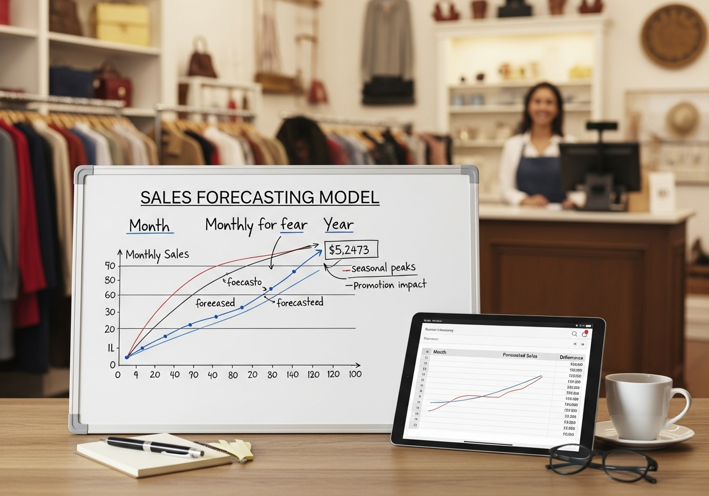

#  Thrift Store Sales Forecasting

## Project Collaboration

Project coordination was managed through [Trello](https://trello.com/invite/b/68c2f4e834cedcd2b23b471f/ATTIef82752897087fa7fa12988a7fcf9426B0D613E7/group-2-phase-5-capstone-project), which acted as our central hub for organizing workstreams and tracking progress. The platform enabled the team to:

- Consolidate notes, analysis updates, and reference materials in one shared space
- Record meeting summaries and document key decisions for future reference
- Monitor individual tasks, deadlines, and responsibilities using collaborative boards
- Facilitate real-time updates and transparent version tracking to reduce miscommunication and improve workflow efficiency

## Project Authors

- Leah Mukundi  
- Rita Nkirote  
- Gerald Mwangi  
- Catherine Maina  
- Joan Njuki  
- Peter Chemonges

# Business Understanding

Thrift store chains in Kenya face significant challenges in managing inventory, staffing, and cash flow due to reliance on manual, reactive sales planning. Without reliable forecasts, managers often depend on intuition to make restocking and staffing decisions, leading to either overstocking or stockouts that affect profitability.
*Can predictive modeling provide more accurate and actionable sales forecasts than traditional intuition-based planning methods used by thrift store managers?*

## Problem Statement

The business currently lacks a data-driven forecasting system to accurately predict weekly sales across multiple stores. This reactive approach leads to inefficiencies such as:

- **Overstocking**, resulting in tied-up capital and unsold inventory.
- **Stockouts**, leading to missed sales opportunities.
- **Inefficient staffing and supply chain planning** due to uncertain demand.

The goal is to build a predictive model that accurately forecasts weekly sales for each store, enabling the business to plan proactively and improve operational efficiency.

## Objectives

- Develop a machine learning model to forecast weekly sales across 11 thrift stores.
- Compare the performance of statistical, machine learning, and deep learning approaches.
- Identify the best-performing model and prepare it for deployment.
- Provide actionable insights that can guide data-driven decision-making in inventory and staffing.

# Stakeholders

- **Store Managers**: Use forecasts to plan inventory and staffing.
- **Business Executives**: Utilize insights for strategic planning and budgeting.
- **Data Team**: Maintain and retrain models as new sales data becomes available.

## Potential Impact

This project can:

- Improve sales predictability and operational efficiency.
- Reduce manual errors in forecasting and planning.
- Support data-driven decisions that enhance profitability and customer satisfaction.

# Data Understanding

## Data Source

The dataset contains three years of historical daily sales data collected from 11 thrift store branches. It includes features such as:

- `Date` — Transaction date.
- `Shop` — Branch identifier.
- `Category` — Product type (e.g., Clothing, Accessories, Footwear).
- `Amount` — Daily sales revenue per store or category.

Data was aggregated at the weekly level to align with the business forecasting horizon.

# Data Preparation

To prepare the dataset for modeling:

- **Handled missing values**: Filled missing sales data with appropriate averages or zeros where applicable.
- **Removed duplicates**: Ensured each store–week pair appeared only once.
- **Converted data types**: Parsed date columns and ensured numerical consistency in sales values.

### Feature Engineering:

- Created lag features and rolling averages to capture sales trends.
- Generated calendar-based features (month, week, day of week) to identify seasonal effects.
- Resampling: Aggregated daily data into weekly series per store for consistent forecasting intervals.

# Exploratory Data Analysis (EDA)

EDA revealed the following insights:

- **Sales seasonality**: Weekly sales showed consistent peaks during festive and back-to-school periods.
- **Shop performance differences**: Urban branches (e.g., Gikomba, Warehouse) had higher but more volatile sales.
- **Category trends**: Certain categories like Clothing and Footwear contributed the majority of revenue.
- **Sales gaps**: Some branches reported missing or zero sales on specific days, likely due to store closures.

These insights informed both the modeling strategy and feature selection process.

# Modeling

Several forecasting models were developed and evaluated, including:

- **Baseline models**: Naïve and Moving Average methods.
- **Statistical models**: SARIMA and Prophet for trend and seasonality modeling.
- **Machine learning models**: Random Forest, XGBoost, and Support Vector Regressor (SVR).
- **Deep learning model**: LSTM for capturing sequential temporal dependencies.

## Evaluation Metrics

- **RMSE (Root Mean Squared Error)** – Measures prediction error magnitude.
- **R² Score** – Measures how well the model explains sales variability.

### Results (Summary)

| Model                          | MAE            | RMSE         | R² Score | Notes                                               |
|-------------------------------|----------------|--------------|----------|-----------------------------------------------------|
| Random Forest (FE, pooled)    | 585,788        | 1,279,279    | 0.5868   | Best overall performance                            |
| LSTM (pooled + cal + shop)    | 624,316        | 1,285,251    | 0.5829   | Strong temporal learning, close second              |
| Moving Average (4)            | 612,119        | 1,309,287    | 0.5672   | Simple baseline with decent trend capture           |
| GradientBoosting (FE, pooled) | 604,400        | 1,372,581    | 0.5243   | Good performance, slightly behind Random Forest     |
| SARIMA (1,1,1)x(1,1,1,52)     | 703,284        | 1,411,438    | 0.4970   | Captures trend but struggles with irregular spikes  |
| Prophet (weekly + yearly)     | 679,648        | 1,411,875    | 0.4967   | Models seasonality, less responsive to fluctuations |
| SVR (FE, pooled)              | 723,997        | 1,460,451    | 0.4615   | Moderate performance, weaker generalization         |
| Naive (last value)            | 995,755        | 2,218,043    | -0.2421  | Baseline reference model                            |

The **Random Forest** model achieved the best balance between accuracy, interpretability, and computational efficiency. It was selected as the final model for deployment.

# Deployment

The chosen Random Forest model was serialized and integrated into a forecasting pipeline for potential deployment. The deployment plan includes a lightweight dashboard or web app where store managers can:

- View predicted weekly sales for each store.
- Compare actual vs. predicted performance.
- Download forecasts for planning purposes.

# Conclusion

This project demonstrates how data science and predictive modeling can transform decision-making in the retail sector. From data cleaning and exploration to model comparison and deployment, the process delivered a practical forecasting solution tailored to the operational needs of Kenyan thrift stores.

## Key Takeaways:

- Machine learning models, especially Random Forest, significantly outperform traditional methods in forecasting complex, multi-store sales data.
- Regular retraining and inclusion of external factors (e.g., holidays, promotions) can further enhance model reliability.
- Data-driven planning reduces uncertainty, minimizes waste, and supports strategic growth.

# Recommendations

### Model Deployment and Maintenance

- Deploy the Random Forest model as the organization’s main forecasting tool.
- Automate monthly retraining as new sales data becomes available.

### Dashboard Integration

- Build a simple dashboard (Streamlit, Power BI, or Flask) for store managers to interact with forecasts.

### Data Quality Improvement

- Standardize data collection across branches and ensure completeness of daily sales logs.

### Hybrid Model Exploration

- Experiment with combining Random Forest and LSTM to leverage both feature-based and sequence-based learning.

### Operational Integration

- Use forecasts to guide inventory purchases, staff scheduling, and promotional planning.

# Future Work

- Extend the model to predict category-level or product-level sales.
- Integrate external factors such as weather or market trends to refine forecasts.
- Implement Explainable AI (XAI) to help managers understand key drivers of sales changes.
- Deploy the model into a fully functional web app accessible to all store branches.

# Technologies Used

- **Python** (`pandas`, `numpy`)
- **scikit-learn** (RandomForest, SVR, GradientBoosting)
- **XGBoost** (optional)
- **statsmodels** (SARIMA)
- **Prophet** (seasonality modeling)
- **TensorFlow / Keras** (LSTM)
- **Matplotlib**, **Seaborn** (visualizations)
- **Jupyter Notebook**
- **Flask** (deployment UI options)
- **Git**, **Trello** (collaboration and version control)
- **Tableau** (dashboarding / visualization)

---

# Final Product

The following resources provide an overview of our project's final deliverables:
| Resource           | Description   | Access Link | 
|----------------|--------|----------|
| Deployed App| API endpoint to prediction model   | [Sales Forecasting App](https://sheltered-eyrie-97374-879898d106db.herokuapp.com/)   |
| Tableau Dashboard  | Interactive dashboard highlighting key insights and trends | [Dashboard](https://public.tableau.com/app/profile/joan.njuki/viz/KenyaSecondHandRetailPerformanceDashboard/Performanceanalysisdashboard1?publish=yes)   | 
